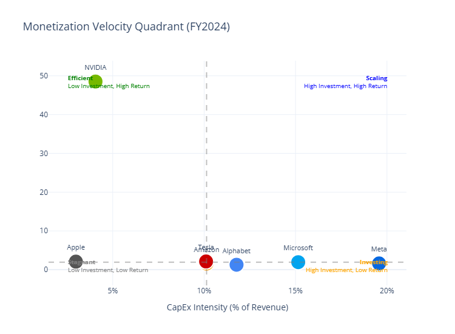
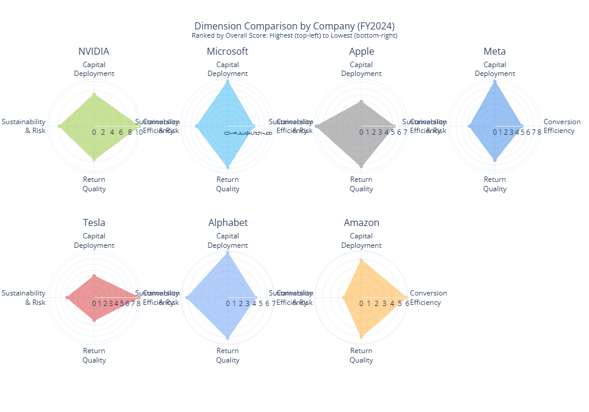

# Capital Allocation Efficiency Scorecard

### Magnificent 7 AI-Related CapEx Analysis (FY2022-2024)

A quantitative framework for evaluating how efficiently the seven largest technology companies convert AI-related capital expenditure into sustainable financial returns.

---

## Key Finding

**NVIDIA is the only "Capital Efficient" company among the Magnificent Seven.**

With an overall score of **8.3/10** and a perfect **10.0 on Conversion Efficiency**, NVIDIA generates $48.54 in revenue for every dollar of CapEx—nearly 10x the peer group median. The remaining six companies are classified as "Capital Intensive," facing investor scrutiny on return timing.



---

## Scorecard Results (FY2024)

| Company | Capital Deployment | Conversion Efficiency | Return Quality | Sustainability | **Overall** | Classification |
|---------|:------------------:|:---------------------:|:--------------:|:--------------:|:-----------:|----------------|
| NVIDIA | 7.1 | **10.0** | 7.4 | 7.8 | **8.3** | Capital Efficient |
| Microsoft | **8.4** | 4.9 | **7.7** | 5.8 | 6.4 | Capital Intensive |
| Apple | 3.9 | 5.2 | 6.4 | 7.1 | 5.7 | Capital Intensive |
| Meta | 8.1 | 4.9 | 6.1 | 4.5 | 5.7 | Capital Intensive |
| Tesla | 3.9 | 8.1 | 4.1 | 4.9 | 5.6 | Capital Intensive |
| Alphabet | 6.8 | 4.2 | 6.1 | 6.1 | 5.6 | Capital Intensive |
| Amazon | 4.9 | 5.8 | 5.1 | 2.3 | **4.8** | Capital Intensive |

*Scores are percentile-based within the peer group (1-10 scale). A score of 5.0 represents median performance.*

---

## The Monetization Velocity Framework

This scorecard operationalizes the concept of **Monetization Velocity**—the time between capital deployment and the first dollar of AI-related revenue.

The market no longer rewards AI investment. It rewards AI revenue.

### Three Categories of Capital Allocation Strategy

| Category | Companies | Characteristic |
|----------|-----------|----------------|
| **Instant ROI** | NVIDIA | Revenue recognized upon chip shipment |
| **Medium-Term ROI** | Microsoft, Apple, Amazon | Copilot subscriptions, AWS, hardware upgrade cycles |
| **Long-Term/Binary** | Alphabet, Meta, Tesla | Defensive acceleration, open-source strategy, autonomy bet |



---

## Methodology

### Four Scoring Dimensions

| Dimension | Weight | What It Measures | Key Metrics |
|-----------|:------:|------------------|-------------|
| **Capital Deployment** | 15% | Magnitude and trajectory of investment | CapEx intensity, CapEx growth rate, CapEx coverage |
| **Conversion Efficiency** | 35% | Speed of capital-to-revenue translation | Revenue yield on CapEx, incremental revenue per CapEx, asset turnover |
| **Return Quality** | 30% | Margin preservation during scaling | Gross margin, operating leverage, FCF margin |
| **Sustainability & Risk** | 20% | Capacity to maintain investment intensity | Net debt to EBITDA, CapEx commitment risk, FCF after CapEx |

### Scoring Approach

1. Calculate 17 financial metrics from SEC 10-K filings
2. Rank each company against peers using percentile scoring
3. Apply dimension weights to calculate overall score
4. Classify companies into efficiency tiers

### Classification Thresholds

| Classification | Score Range | Interpretation |
|----------------|:-----------:|----------------|
| Capital Efficient | 7.0 - 10.0 | Successfully converting CapEx to revenue |
| Capital Intensive | 4.0 - 6.99 | Heavy investment with uncertain return timing |
| Capital Dependent | 1.0 - 3.99 | Investment outpacing revenue generation |

---

## Data Sources

- **SEC 10-K Filings** (FY2022, FY2023, FY2024) — Consolidated financials, segment data, purchase obligations
- **Earnings Call Transcripts** — FY2025 CapEx guidance
- **Company Investor Relations** — Forward guidance verification

### NVIDIA Fiscal Year Note

NVIDIA's fiscal year ends in January. Throughout this analysis:
- "FY2024" for NVIDIA refers to their fiscal year ending January 2025
- This aligns NVIDIA's most recent annual results with calendar 2024 peers

---

## Repository Structure

```
├── data/
│   ├── consolidated_financials.csv    # 21 rows (7 companies × 3 years)
│   ├── segment_financials.csv         # 48 rows (segment-level data)
│   ├── forward_guidance.csv           # 7 rows (FY2025 guidance)
│   └── purchase_obligations.csv       # 21 rows (commitment data)
│
├── outputs/
│   ├── scorecard_heatmap.png
│   ├── radar_chart.png
│   ├── capex_trend.png
│   ├── velocity_quadrant.png
│   ├── segment_margins.png
│   ├── forward_guidance.png
│   └── executive_summary.md
│
├── Project_1_Capital_Allocation_Efficiency_Scorecard.ipynb
└── README.md
```

---

## Getting Started

### Prerequisites

- Python 3.8+
- Google Colab (recommended) or Jupyter Notebook

### Installation

```bash
# Clone the repository
git clone https://github.com/[your-username]/capital-allocation-scorecard.git
cd capital-allocation-scorecard

# Install dependencies
pip install pandas numpy matplotlib seaborn plotly openpyxl kaleido
```

### Running the Analysis

1. Open `Project_1_Capital_Allocation_Efficiency_Scorecard.ipynb` in Google Colab
2. Mount Google Drive when prompted
3. Ensure data files are in `/content/drive/MyDrive/Projects/CapEx_Scorecard/data/`
4. Set `USE_SYNTHETIC_DATA = False` in Section 2.5
5. Run all cells (Runtime → Run all)

---

## Key Insights

### Why NVIDIA Dominates

NVIDIA's exceptional score stems from a unique business model position:

| Metric | NVIDIA | Peer Median | Multiple |
|--------|-------:|------------:|---------:|
| Revenue Yield on CapEx | $48.54 | $1.94 | **25x** |
| FCF Margin | 57% | 19% | **3x** |
| CapEx Intensity | 4% | 12% | **0.3x** |

NVIDIA invests less (as % of revenue) while generating dramatically more return per dollar invested. This reflects their position as the infrastructure provider rather than infrastructure consumer.

### The Amazon Anomaly

Amazon scored lowest (4.8) despite being categorized as "Instant ROI" in the Monetization Velocity framework. The model reveals:

- **FCF Margin**: 1% (near zero cash generation)
- **CapEx Commitment Risk**: 2.19 (highest in peer group)
- **Net Debt to EBITDA**: 0.56 (elevated leverage)

This highlights the difference between *strategic positioning* (strong) and *near-term capital efficiency* (strained). Amazon's dual monetization advantage doesn't yet appear in FY2024 metrics due to heavy reinvestment.

### AI Segment Profitability Reality

| Company | AI-Primary Segment | Operating Margin |
|---------|-------------------|:----------------:|
| NVIDIA | Compute & Networking | **71.2%** |
| Microsoft | Intelligent Cloud | 46.5% |
| Apple | Consolidated | 31.1% |
| Amazon | AWS | 29.7% |
| Tesla | Automotive | 10.2% |
| Alphabet | Google Cloud | 4.8% |
| Meta | Reality Labs | **-682%** |

Meta's Reality Labs operates at a -$22.5B annual loss—the open-source strategy carries significant near-term cost with uncertain monetization timeline.

---

## Forward Outlook (FY2025)

Based on disclosed guidance, six of seven companies are **accelerating** CapEx investment:

| Company | FY2025 Guidance | vs. FY2024 Actual | Trajectory |
|---------|----------------:|:-----------------:|------------|
| Microsoft | $82.5B | +116% | Accelerating |
| Meta | $62.5B | +94% | Accelerating |
| Amazon | $105.0B | +69% | Accelerating |
| Alphabet | $57.5B | +41% | Accelerating |
| NVIDIA | $10.0B | +88% | Accelerating |
| Tesla | $11.0B | +11% | Accelerating |
| Apple | $13.0B | +12% | **Stable** |

Apple remains the disciplined outlier, betting that AI models become commodities before their perceived gap becomes a competitive threat.

---

## Limitations

1. **Peer Group Only**: Scores reflect relative positioning within the Magnificent Seven, not absolute efficiency thresholds
2. **Historical Data**: Analysis based on FY2024 audited results; Q1-Q2 2025 may show different patterns
3. **AI Attribution**: CapEx figures represent total capital expenditure, not AI-specific allocation (companies do not consistently disclose AI-only CapEx)
4. **Fiscal Year Alignment**: NVIDIA's January fiscal year-end creates a ~1 month offset vs. calendar-year peers

---

## Related Work

- [Monetization Velocity: The Metric Separating AI Winners from Believers](https://www.linkedin.com/pulse/monetization-velocity-metric-separating-ai-winners-ekkarit-twx7c/) — LinkedIn article introducing the conceptual framework

---

## Author

**Ekkarit Gaewprapun, DBA, CMA, FMVA**

Strategic Foresight and Financial Intelligence professional with 25+ years of experience in finance transformation, decision analytics, and long-range strategic planning.

- [LinkedIn](https://www.linkedin.com/in/ekkarit-gaewprapun-cma-fmva%C2%AE-3153a0151/)
- [GitHub]((https://github.com/ekkaritg-USA)

---

## License

This project is licensed under the MIT License. See [LICENSE](LICENSE) for details.

---

## Acknowledgments

- SEC EDGAR for public filing access
- Company investor relations teams for guidance disclosures
- The analytical framework builds on established capital efficiency research in corporate finance literature
